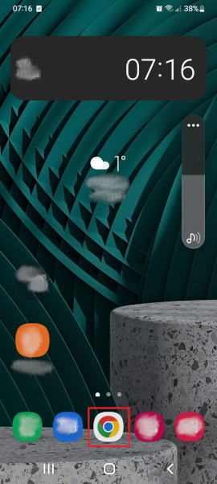
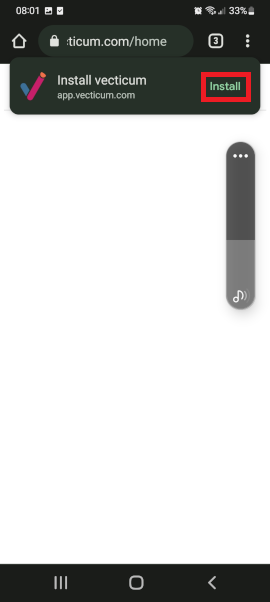
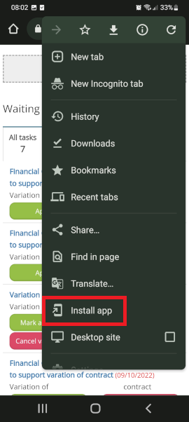
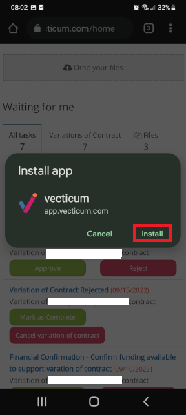
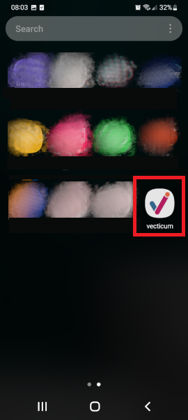
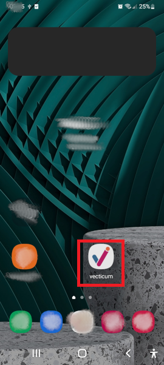

# Vecticum App on Android

## How to install Vecticum App on Android and locate on home screen

1. Start browser (for example Chrome) on Android.

<figure><figcaption></figcaption></figure>

2\. In browser, navigate to app.vecticum.com and login.

<figure><figcaption></figcaption></figure>

3\. Choose Install in appearing popup.

<figure><figcaption></figcaption></figure>

or from browser menu choose Install app&#x20;

<figure><figcaption></figcaption></figure>

4\. Confirm to install in the appearing dialog.

<figure><figcaption></figcaption></figure>

5\. Once it is installed, it is located at the end of your apps list:

<figure><figcaption></figcaption></figure>

6\. By pressing and holding the vecticum above shortcut (icon) you can drag and drop the app on your main - home screen:

<figure><figcaption></figcaption></figure>
