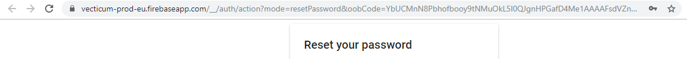
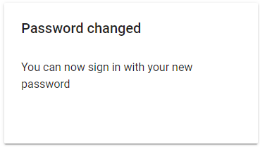

# Initiate password reset

## Initiate password reset

User or company administrator can reset your password. To do that you need to:

1. Click on your profile picture.
2. Find reset password button and press it.


This only works through email


## Password reset pop-up page

A pop-up will show up and it will take you to another safe page. If you have ads blocked - it won't work.

If this pop-up doesn't  show up - restart the page.

1. In this pop-up create a new strong and safe password.
2. After creating and memorizing it - click save.

After seeing this, you can comeback to home page.
