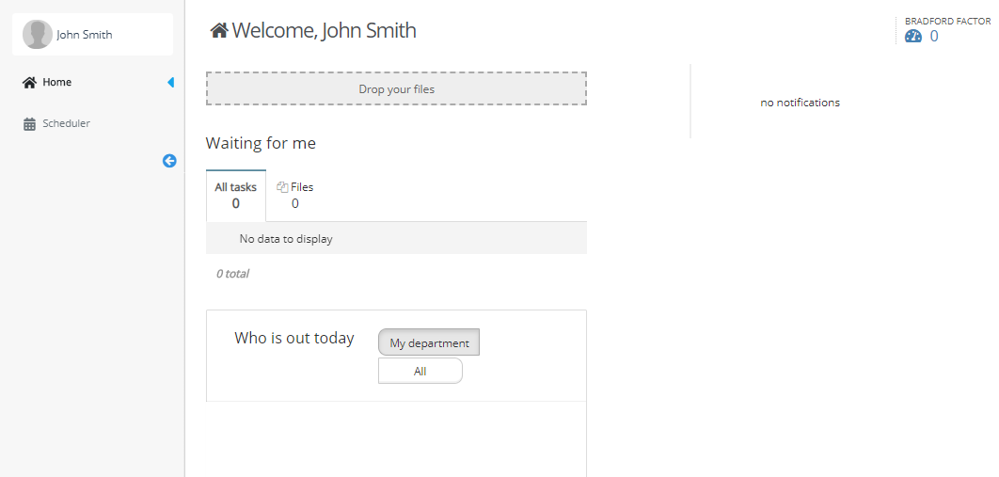

# Sign-up

## In order to log in to our app, at first you need to get an invite.

1. Open the mail you've got.
2. Click on the link "Register" or just press the green button.

## Then you'll need to register.

1. Fill the blank spots.
2. The corporation who invited you to join this app will show up above the "Terms and Conditions"
3. Make sure you read or know "Terms and Conditions" and accept it.


If you're signing in with your phone number, go straight to login section.


## After registering everything should look like this.

